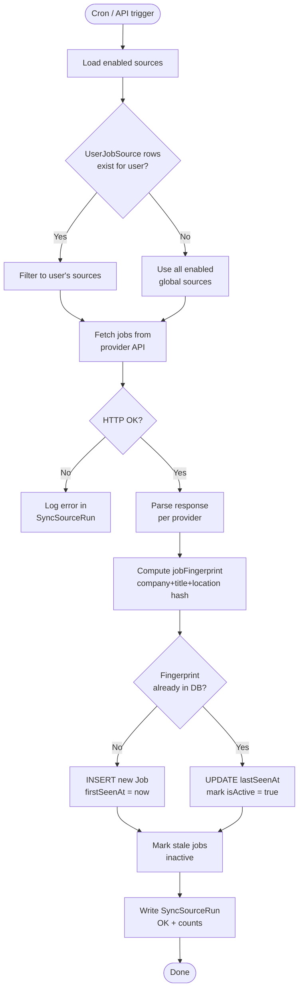
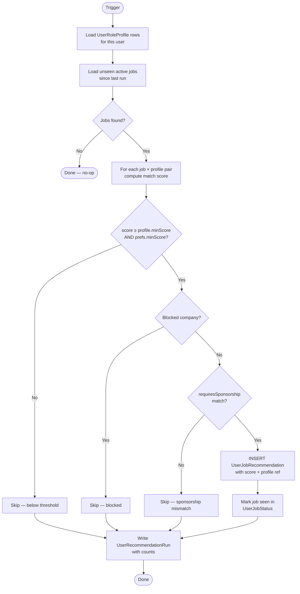
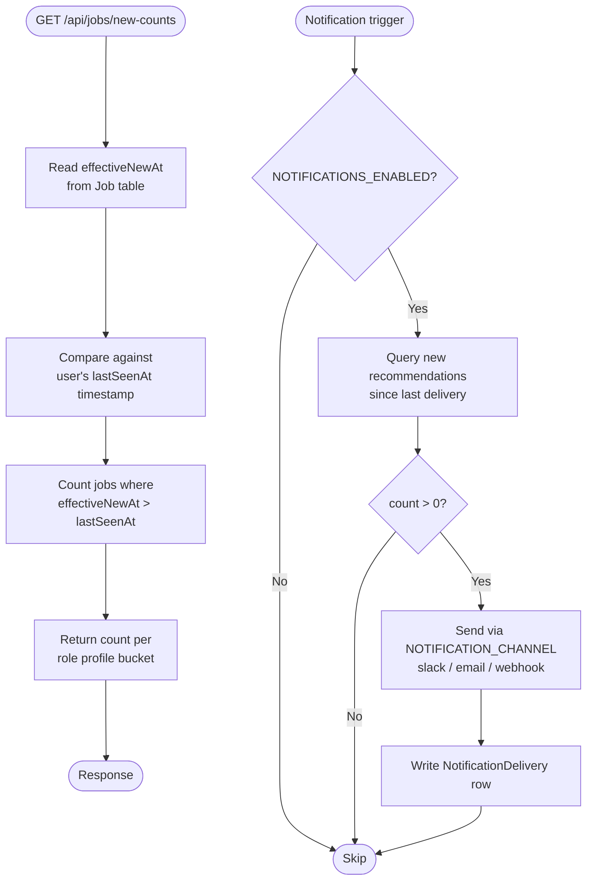
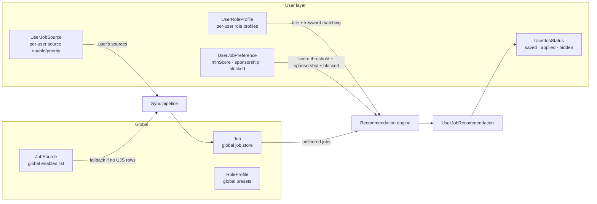

# JobRadar — System Logic & Architecture

A concise reference for how data flows through the major subsystems: job sync, recommendation generation, new-job detection, and per-user preference resolution.

---

## 1. Job Sync Pipeline

Runs on a schedule (hourly cron) or on demand via `POST /api/sync/start`.



**Key tables:** `JobSource`, `UserJobSource`, `Job`, `SyncRun`, `SyncSourceRun`

**Fallback rule:** If a user has zero `UserJobSource` rows, sync and recommendations fall back to all globally-enabled `JobSource` rows. This preserves backward compatibility for single-user / default-user setups.

---

## 2. Recommendation Engine

Runs after sync, or on demand via `POST /api/recommendations/run`.



**Score components:**
- Title match against `preferredTitles` → up to 40 pts
- Must-have keywords present → up to 30 pts
- Nice-to-have keywords present → up to 15 pts
- Negative keywords absent → up to 15 pts (penalty if present)
- Location preference match → bonus

**Key tables:** `UserRoleProfile`, `UserJobPreference`, `UserJobRecommendation`, `UserRecommendationRun`, `UserJobStatus`

---

## 3. New-Job Detection

Powers the "New since last visit" badge and optional notifications.



**effectiveNewAt** is set to `firstSeenAt` for brand-new jobs, or bumped to `NOW()` when a previously-inactive job becomes active again after an absence. This lets "new" mean "genuinely appeared recently" rather than "first ever seen."

---

## 4. User Preference Resolution

Shows how per-user config layers over global config.



---

## 5. Onboarding → Config Mapping

Shows how onboarding wizard answers flow into DB tables.

```mermaid
flowchart TD
    W([Onboarding wizard\nPOST /api/onboarding]) --> P[Parse OnboardingData]
    P --> UP[Upsert UserJobPreference\nminScore · sponsorship\ntargetLocations · targetRoles\nblockedCompanies]
    P --> RP[Create UserRoleProfile\n"My Job Search Profile"\npreferredTitles = selected titles\nmustHaveKeywords = selected skills]
    P --> OB[Mark UserOnboarding\nonboardingCompleted = true]
    UP & RP & OB --> J([Issue JWT cookie\nonboardingCompleted claim = true])
    J --> HOME([Redirect → /])
```

---

## 6. Reset Modes

`POST /api/profile/reset` with `{ mode }`:

| Mode | What it clears | Requires |
|---|---|---|
| `prefs` | `UserJobPreference` → defaults; clears `prefsJson` | — |
| `onboarding` | Sets `onboardingCompleted = false`; clears `prefsJson` | — |
| `sources` | Deletes all `UserJobSource` rows | — |
| `jobs` | Deletes `UserJobStatus`, `UserJobRecommendation`, `UserRecommendationRun` | — |
| `workspace` | All of the above + deletes `UserRoleProfile` rows | `confirm: "RESET"` |
